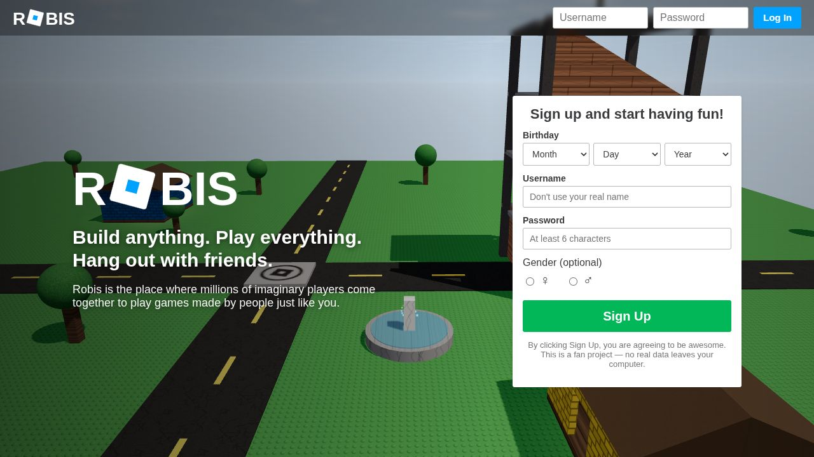
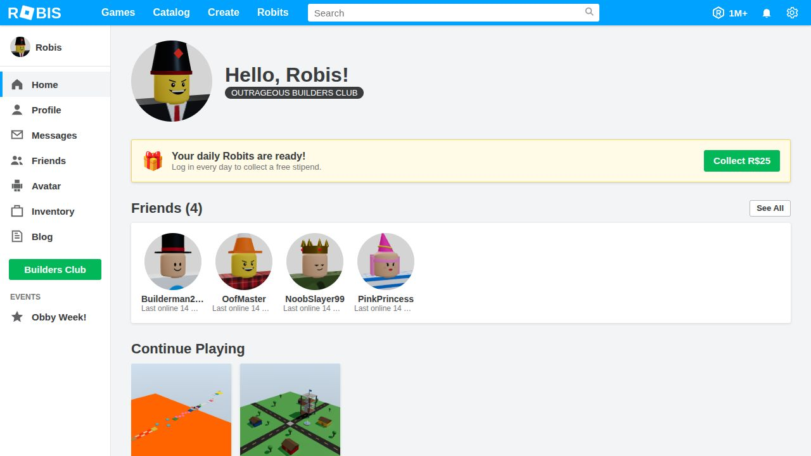
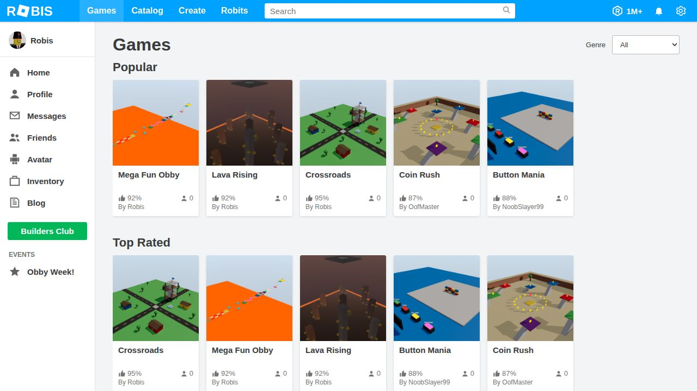
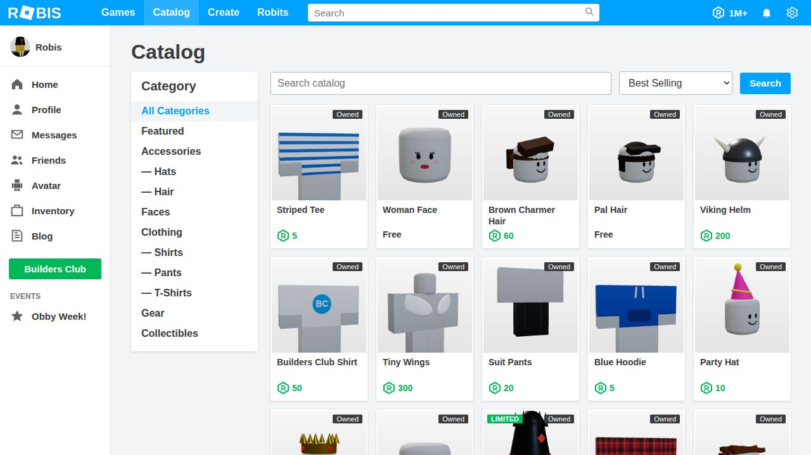
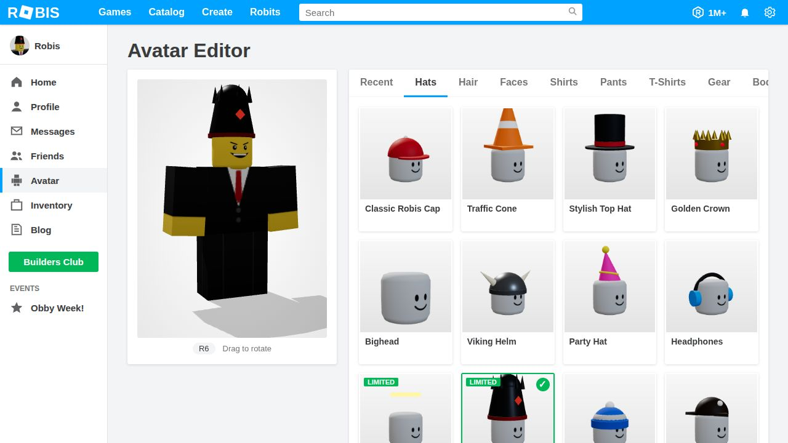
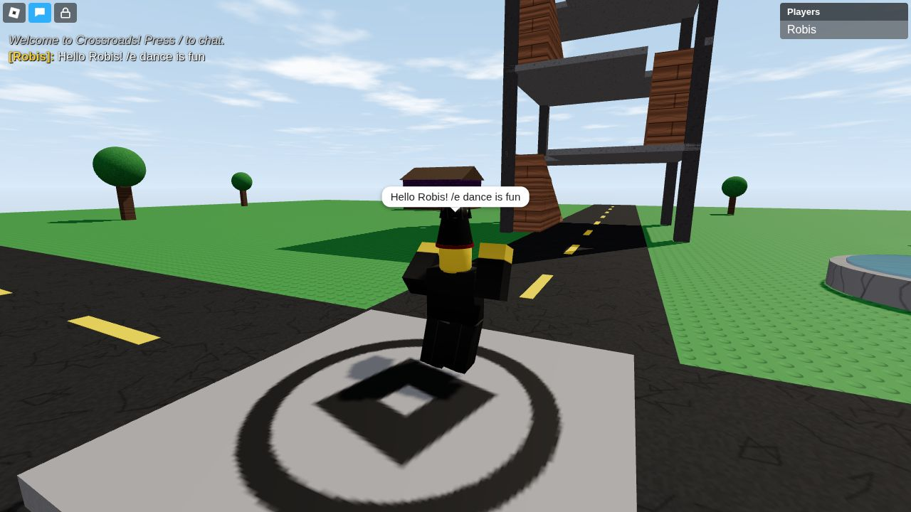
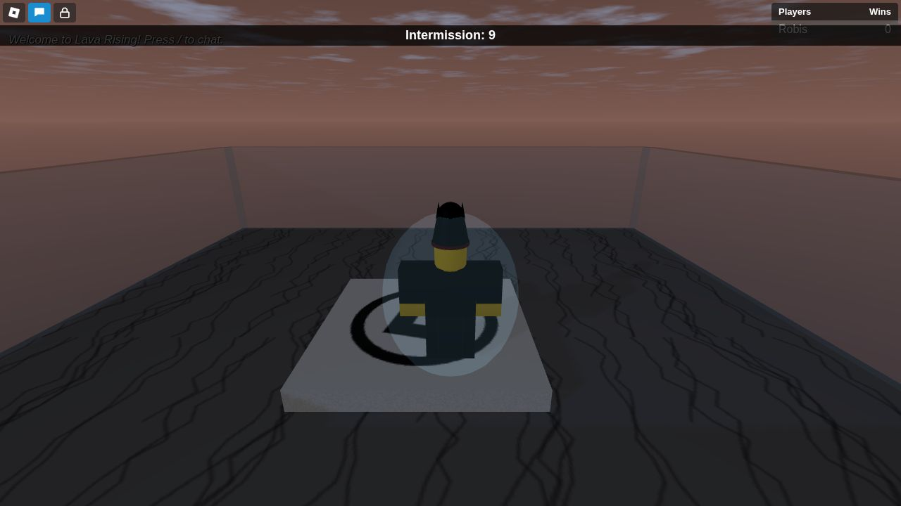
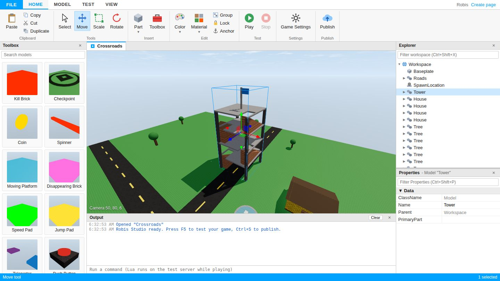
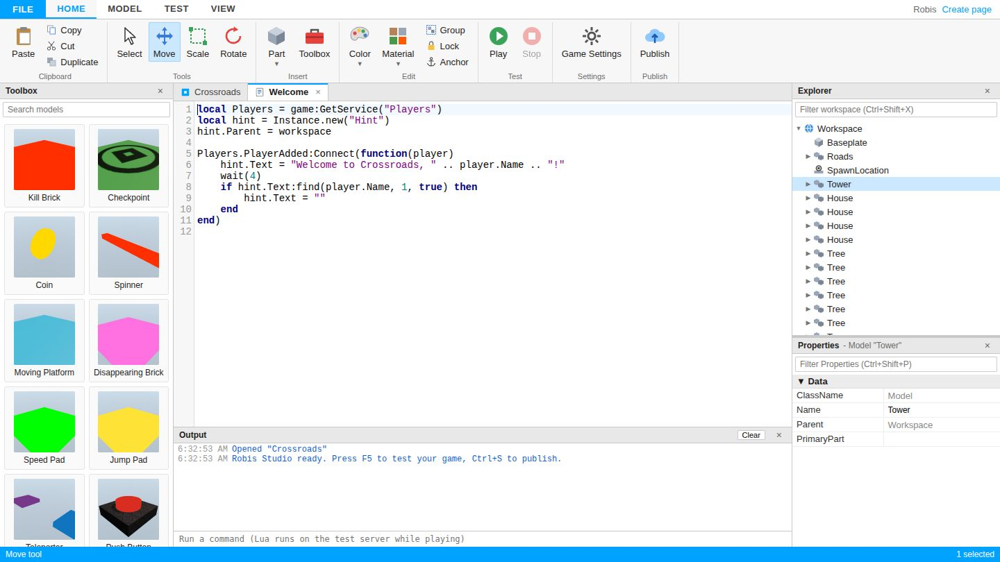

<p align="center">
  
</p>

<h1 align="center">ROBIS</h1>

<p align="center">
  <b>Игровая платформа в стиле Roblox 2019 года — в одном Node.js-приложении.</b><br>
  Сайт, многопользовательский 3D-клиент, скрипты на Lua и <b>Robis Studio</b> работают прямо в браузере.
</p>

<p align="center">
  <a href="README.md">🇬🇧 English</a> · 🇷🇺 Русский
</p>



> **Дисклеймер:** Robis — некоммерческий фанатский проект с открытым исходным кодом, дань эпохе
> игровых платформ 2019 года. Он не связан с Roblox Corporation и не одобрен ею. Вся графика (логотип,
> текстуры, аватары, шапки, лица, звуки) генерируется кодом, чужих ассетов в проекте нет.

---

## Содержание

- [Возможности](#возможности)
- [Быстрый старт](#быстрый-старт)
- [Как установить на телефон](#как-установить-на-телефон)
- [Онлайн-сервер: играть с друзьями](#онлайн-сервер-играть-с-друзьями)
- [Скриншоты](#скриншоты)
- [Управление](#управление)
- [Robis Studio](#robis-studio)
- [Lua API](#lua-api)
- [Архитектура](#архитектура)
- [REST API](#rest-api)
- [Настройки](#настройки)
- [Тесты](#тесты)
- [Ограничения и планы](#ограничения-и-планы)

## Возможности

### 🌐 Сайт в стиле 2019 года
- Синяя шапка, левое меню, шрифт `Source Sans Pro`, карточки игр с процентом лайков и онлайном.
- **Лендинг** со входом и регистрацией, фоном служит живая 3D-сцена карты *Crossroads*.
- **Главная**: приветствие с аватаркой, друзья со статусами (В сети, В игре, В Studio), *Continue Playing*, рекомендации и избранное.
- **Игры**: разделы Popular, Top Rated, Featured, Recently Updated и Most Visited, фильтр по жанру и поиск.
- **Страница игры**: большая зелёная кнопка ▶, окно *«Robis is now loading. Get ready to play!»* как в 2019-м, лайки и дизлайки, избранное, статистика и **список серверов** с возможностью зайти на нужный.
- **Каталог**: 48 предметов (шапки, причёски, лица, рубашки, штаны, футболки, снаряжение), **лимитки** с ограниченным тиражом. Покупка за **Robits (R$)** — вымышленную валюту.
- **Редактор аватара** с живым вращаемым 3D-превью R6, цветами частей тела и сеткой вещей.
- **Профиль**: статус, «о себе», *Currently Wearing*, друзья, любимые игры, **значки (badges)** из игр и творения.
- **Друзья** (заявки и поиск игроков), **Сообщения** (входящие, отправленные, ответы), **Инвентарь**, **Robits** (ежедневная награда и история транзакций), страница **Create**, блог, помощь и страница 404 (*«Oof!»*).
- Все миниатюры (аватарки, полный рост, предметы, иконки игр) рендерятся в браузере на Three.js, миниатюры игр кешируются на сервере.

### 🎮 Игровой клиент
- Мультиплеер по WebSocket: мир ведёт сервер, персонажем управляет клиент.
- Классический **R6-аватар** с анимациями ходьбы, прыжка, падения, покоя и удержания предмета, эмоциями (`/e dance`, `/e dance2`, `/e dance3`, `/e wave`, `/e point`, `/e cheer`, `/e laugh`) и знаменитой **смертью с разлётом частей** и звуком *oof* (синтезируется через WebAudio).
- Камера: вращение с правой кнопкой мыши, зум, **вид от первого лица**, **Shift Lock**. Если камеру загораживает стена, она подтягивается к персонажу.
- Физика: коллизии капсулы с блоками, шарами, цилиндрами и клиньями. Персонаж заходит на ступеньки и рампы и **ездит на движущихся платформах**.
- HUD 2019 года: чат с цветами ников и **пузырями над головой**, **таблица лидеров** из `leaderstats`, полоска здоровья, объекты `Hint` и `Message`, ESC-меню (Players / Settings / Help, кнопки *Reset Character* и *Leave Game*). Ещё есть экран загрузки, окна отключения, **консоль разработчика (F9)** и **сенсорное управление** для телефонов.
- Материалы: Plastic со **стадами и выемками**, Wood, WoodPlanks, Brick, Slate, Concrete, Marble, Granite, Metal, DiamondPlate, CorrodedMetal, Grass, Sand, Ice, Fabric, Glass, **Neon** и ForceField. Все генерируются процедурно.
- Небо с процедурными облаками, солнцем, луной и звёздами, смена дня и ночи по `Lighting.ClockTime`, туман и тени.
- Эффекты: `Fire`, `Sparkles`, `Smoke`, `PointLight`, `SpotLight`, `Explosion` (с отбрасыванием), `BillboardText`, `ForceField` и `ClickDetector` (с курсором при наведении).

### 🛠️ Robis Studio
- Интерфейс Studio 2019 года: меню **FILE**, вкладки ленты HOME / MODEL / TEST / VIEW, панели Toolbox, Explorer, Properties, Output и Command Bar.
- 3D-вьюпорт с камерой полёта (ПКМ + WASD/QE, колесо, панорама средней кнопкой, `F` — фокус) и гизмо **Select / Move / Scale / Rotate** с шагом по сетке и углу, в мировых или локальных координатах.
- **Explorer**: дерево объектов, множественный выбор, перетаскивание (смена родителя), переименование (F2), фильтр, контекстное меню и *Insert Object*.
- **Properties**: типизированные редакторы (Vector3, Color3 с палитрой, BrickColor, перечисления, флажки, числа) с группировкой по категориям.
- **Редактор скриптов** (CodeMirror) с подсветкой Lua и вкладками.
- **Play (F5)** запускает несохранённое место на приватном тестовом сервере прямо во вьюпорте. `print`, `warn` и ошибки сервера (со стеком вызовов) попадают в Output, а Explorer показывает живую игру.
- Undo и Redo, буфер обмена, дублирование, группировка и разгруппировка, Anchor, Lock, выбор цвета и материала, поворот и наклон на 90°.
- **Toolbox** с готовыми моделями со скриптами: Kill Brick, Checkpoint, Coin, Spinner, Moving Platform, Disappearing Brick, Speed и Jump Pad, Teleporter, Push Button, фонарь, дерево, костёр, кирпичный дом, скрипт таблицы лидеров и скрипт смены дня и ночи.
- Шаблоны (Baseplate, Classic, Flat Terrain, Obby), **Publish to Robis** (с автоматической миниатюрой), настройки игры, сохранение и открытие файлов `.robis.json`.

### 📜 Скрипты на Lua 5.3 (на сервере)
- Работают на [fengari](https://github.com/fengari-lua/fengari). Каждый `Script` выполняется в своей корутине, так что `wait()`, `spawn`, `delay`, `:Wait()` и `WaitForChild` действительно приостанавливают выполнение.
- API как в Roblox: `game`, `workspace`, `script`, `Instance.new`, `Vector3`, `CFrame`, `Color3`, `BrickColor`, `Enum`, `TweenInfo`, `UDim2`, `Random`, события (`Touched`, `Changed`, `PlayerAdded`, `Died` и другие).
- Сервисы: Players, Lighting, **TweenService**, **DataStoreService** (данные сохраняются), RunService (Heartbeat и Stepped), Debris, HttpService (JSON и GUID), **BadgeService** (значки видны в профиле), ReplicatedStorage, ServerStorage и ServerScriptService. `ModuleScript` подключается через `require`.
- Песочница: нет `io`, `os.execute`, загрузки файлов и байткода. **Таймаут 10 секунд** останавливает бесконечные циклы.

### 🎲 Четырнадцать готовых игр
| Игра | Что показывает |
|---|---|
| **Crossroads** | Классическая карта для общения: башня, дома, фонтан, смена дня и ночи |
| **Mega Fun Obby** | 8 этапов, чекпоинты, `leaderstats`, сохранение в **DataStore**, движущиеся и исчезающие платформы, вертушка, ускорители и батуты, значок |
| **Coin Rush** | Вращающиеся монеты (`RunService.Heartbeat`), leaderstats, сохранение рекорда |
| **Lava Rising** | Раунды с таймером в `Hint`, поднимающаяся лава (tween) и счёт побед (Wins) |
| **Button Mania** | Кнопки на `ClickDetector`, дождь из падающих кирпичей, взрывы и «вечеринка» |
| **Disaster Island** | Раунды со случайными катастрофами: наводнение, метеоритный дождь (tween + `Explosion`) и землетрясение, от которого рушатся дома; карта восстанавливается через `Clone()` |
| **Tower of Robis** | Башня-обби по спирали: лава, **лазание по фермам (truss)**, чекпоинты, победы и значок |
| **Speed Run** | Неоновая трасса на время (`tick()`), ускорители и рекорд в DataStore |
| **Brick Tycoon** | Займи участок: дропперы гонят кирпичи по конвейеру и приносят Cash, покупай улучшения кнопками |
| **Robis Café** | Место для общения: пеки пиццу, бери газировку (`ClickDetector`), устрой дискотеку у музыкального автомата |
| **Sprint Race** | Шесть дорожек, обратный отсчёт, ворота открываются на GO, барьеры и места на финише |
| **Capture the Flag** | **Команды** (красные против синих, командные спавны и таблица): укради флаг, осаливай врагов на своей половине |
| **Freeze Tag** | Водящие замораживают касанием, бегущие размораживают друг друга; от 2 игроков |
| **King of the Hill** | Стой на золотой короне, чтобы получать очки (вдвое больше в одиночку), и не попади под ударную волну |

## Быстрый старт

Нужны **Node.js 18+** (проверено на Node 22) и браузер с поддержкой WebGL.

```bash
git clone <этот репозиторий> robis && cd robis
npm install
npm start
```

Откройте **http://localhost:3000** и нажмите **Sign Up**, чтобы создать свой аккаунт.

### Аккаунты

Готовых аккаунтов с паролями нет: каждый игрок сам регистрируется на главной странице (логин от 3 до 20 символов, пароль от 6 символов).

- **Первый зарегистрированный аккаунт становится администратором** сервера. Он получает 1 000 000 R$, Outrageous Builders Club и все вещи каталога, может редактировать и удалять любые игры и открывать **Admin Panel** (меню ⚙ или More). В панели можно выдавать игрокам Robits и все вещи, менять членство, назначать админов и банить.
- **Бан** (Admin Panel → Ban) выкидывает игрока из аккаунта и из игр. Выберите тип: **Account only** (обычный бан аккаунта) или **Account + device and IP** (новый аккаунт тоже не создать; устройства и IP самих админов никогда не блокируются) и срок: 1 час, 1/3/7/30 дней или навсегда. Временный бан снимается сам.
- **Команды в чате** любой игры (для админов; создатель игры может использовать весёлые команды в своей игре). Цель: ник (или его начало), `me`, `all`, `others`. Список — `:cmds`.

  | Команда | Что делает |
  |---|---|
  | `:kill` `:respawn` `:heal` | Убить, возродить, вылечить |
  | `:god` / `:ungod`, `:ff` / `:unff` | Бессмертие / силовое поле |
  | `:speed ник 50`, `:jump ник 120` | Скорость и сила прыжка |
  | `:freeze` / `:thaw` | Заморозить и разморозить |
  | `:explode` `:fire` `:sparkles` `:clean` | Эффекты (и убрать их) |
  | `:invisible` / `:visible` | Сделать невидимым |
  | `:tp a b`, `:bring ник`, `:to ник` | Телепорты |
  | `:mute` / `:unmute`, `:kick ник причина` | Модерация |
  | `:announce текст`, `:hint текст`, `:time 0-24` | Большое сообщение, верхняя полоса, время суток |
  | `:ban ник [1h\|1d\|7d\|30d] причина`, `:hardban …`, `:unban ник` | Бан аккаунта, бан аккаунта и устройства, разбан (админы) |
- **Код администратора.** Запустите сервер с `ROBIS_ADMIN_CODE=ваш-код npm start` — и любой аккаунт сможет стать админом через ⚙ → **Enter Admin Code**. В версии для телефона (GitHub Pages) правила «первый аккаунт — админ» нет: админка выдаётся **только** по секретному коду, который знает лишь владелец репозитория (в приложении хранится только его SHA-256 хеш, `standalone/admin-code.sha256`). Свой код: `ROBIS_ADMIN_CODE=ваш-код npm run build:standalone`.
- **Robits и Builders Club купить нельзя.** Игроки зарабатывают Robits ежедневной выплатой (25 R$, а с BC / TBC / OBC — 40 / 60 / 85 R$). Выдавать Robits и членства могут только админы в Admin Panel. Валюта вымышленная, настоящие деньги нигде не списываются.
- Каждый новый игрок получает **100 R$** и стартовые вещи: Bacon Hair, Pal Hair, Smile, Man Face, Woman Face, Blue Hoodie, Jeans, Robis Logo T-Shirt и Classic Robis Cap. Ещё 25 R$ можно забирать каждый день.
- `Robis` — служебный «официальный» аккаунт: ему принадлежат каталог и готовые игры. У него нет пароля, войти в него нельзя, ему нельзя писать и отправлять заявки в друзья.
- Забыли пароль? Остановите сервер и выполните `npm run reset-password ВашЛогин` — в консоли появится новый пароль. Можно задать и свой: `npm run reset-password ВашЛогин новый-пароль`.

Полезные команды:

```bash
npm run dev     # автоперезапуск при изменении сервера (node --watch)
npm run seed    # СТЕРЕТЬ ./data и создать мир заново
npm run reset-password <логин> [пароль]   # сбросить пароль игрока (сервер остановлен)
npm test        # запустить тесты
npm run build:standalone   # собрать автономную версию для телефона в dist/
```

Docker:

```bash
docker build -t robis .
docker run -p 3000:3000 -v robis-data:/data robis
```

## Как установить на телефон

У Robis есть **автономная версия**: она целиком работает на самом телефоне, и компьютер не нужен. Сервер, Lua-скрипты, аккаунты и игры запускаются прямо в браузере телефона, а данные хранятся в его памяти. После первого открытия всё работает **даже без интернета**.

### Установка (1 минута)

1. **Откройте на телефоне** ссылку **https://tatogart.github.io/RoBi19/**. Для первого раза нужен интернет, чтобы скачать приложение (около 3 МБ).
2. **Создайте аккаунт:** нажмите **Sign Up** и придумайте логин и пароль. Все аккаунты — обычные игроки; владелец получает админку через ⚙ → **Enter Admin Code**.
3. **Добавьте на главный экран:**
   - **Android (Chrome):** меню **⋮** → **«Установить приложение»** (или **«Добавить на главный экран»**) → **«Установить»**.
   - **iPhone / iPad (Safari):** кнопка **«Поделиться»** (квадрат со стрелкой вверх) → **«На экран „Домой“»** → **«Добавить»**.
4. **Готово.** Открывайте Robis с синего значка на главном экране, как обычное приложение. Можно включить авиарежим: игры, аватар, каталог и Studio продолжат работать.

Как играть: выберите игру → зелёная кнопка ▶ → поверните телефон горизонтально → кнопка полноэкранного режима. Стик слева, прыжок справа, камера — провести пальцем, зум — двумя пальцами.

### Что важно знать

- **Всё хранится на телефоне.** Аккаунты, купленные вещи, игры и сохранения DataStore лежат в памяти браузера. Если очистить данные сайта в браузере или удалить значок и данные, мир начнётся заново.
- **На iPhone обязательно добавьте значок на главный экран.** Safari может стирать данные сайтов, которые не открывались 7 дней, а приложения с главного экрана это правило не затрагивает.
- **Мир у каждого телефона свой**, но играть вместе всё равно можно: см. [Играть с друзьями в приложении](#играть-с-друзьями-в-приложении). Для одного общего мира с общими аккаунтами — [онлайн-сервер](#онлайн-сервер-играть-с-друзьями).
- **Обновления ставятся сами.** Приложение проверяет новую версию при открытии (и каждые 30 минут) и перезагружается с ней; во время игры ждёт, пока вы выйдете.
- Используйте Robis в одной вкладке: две открытые вкладки могут перезаписать данные друг друга.

### Играть с друзьями в приложении

1. **Хозяин** открывает игру и нажимает **Play with friends**. В игре появится **код комнаты** (например, `K7QM4X`); кнопка **Share** — отправить его.
2. **Друзья** нажимают **Join a friend** (на главной, на странице любой игры или в меню ⚙) и вводят код.
3. Все играют в игре хозяина: мультиплеер, чат, командные игры, команды админа и баны хозяина работают. Друзья появляются в мире хозяина со своим ником и аватаром.

Нужен интернет на обоих устройствах (Wi‑Fi или мобильный). Публичный сервер PeerJS только знакомит устройства, сама игра идёт напрямую между ними. Комната живёт, пока хозяин в игре.

### Установка на ПК или Mac

Приложение ставится на компьютер так же просто, как на телефон:

1. Откройте **https://tatogart.github.io/RoBi19/** в **Chrome** или **Edge** (Windows, macOS, Linux, ChromeOS).
2. Нажмите **Install Robis** (на стартовой странице или в меню ⚙) и подтвердите. Или нажмите значок установки справа в адресной строке.
3. У Robis появится своё окно и значок на рабочем столе / в меню «Пуск» / в Dock; он работает без интернета и обновляется сам.

На Mac в **Safari**: Файл → **Добавить в Dock**. Firefox не умеет устанавливать веб‑приложения — используйте Chrome или Edge.

### Для владельца репозитория: как опубликовать ссылку

Ссылка выше появится после первой публикации:

1. Влейте ветку в `main`.
2. На GitHub: **Settings → Pages → Build and deployment → Source: GitHub Actions**.
3. Workflow `.github/workflows/pages.yml` сам соберёт автономную версию (`npm run build:standalone`) и выложит её. Каждый новый push в `main` обновляет приложение, и телефоны получают обновление при следующем открытии с интернетом.

Собрать вручную: `npm run build:standalone` создаёт папку `dist/`, которую можно выложить на любой статический хостинг. Если сайт открывается не с корня домена, задайте путь: `ROBIS_BASE=/имя-папки npm run build:standalone`.

### Совместная игра по Wi-Fi (серверная версия)

Чтобы играть вместе на одном сервере, запустите `npm start` на компьютере. В консоли появится адрес вида `http://192.168.1.23:3000`: откройте его на телефонах в той же Wi-Fi сети. Если не открывается, на Windows разрешите Node.js в брандмауэре для частных сетей. Для игры через интернет используйте туннель `npx cloudflared tunnel --url http://localhost:3000` или разверните проект на хостинге с помощью `Dockerfile`.

## Онлайн-сервер: играть с друзьями

В версии для телефона у каждого телефона свой отдельный мир, поэтому друзья там друг друга не видят. Для одного общего мира (друзья, чат, мультиплеер, баны через Admin Panel) запустите онлайн-сервер. Это бесплатно на [Render](https://render.com), компьютер не нужен:

[](https://render.com/deploy?repo=https://github.com/tatogart/RoBi19)

1. **Создайте токен GitHub**, чтобы аккаунты не пропадали при перезапуске: [github.com/settings/personal-access-tokens/new](https://github.com/settings/personal-access-tokens/new) → *Repository access: Only select repositories* → `RoBi19` → *Permissions → Contents: Read and write* → **Generate token**. Скопируйте его.
2. Нажмите **Deploy to Render** выше и войдите через GitHub.
3. Заполните два поля:
   - `ROBIS_ADMIN_CODE` — ваш секретный код админа (например, `ABCD-1234-WXYZ`). На этом сервере никто не становится админом сам: вы вводите этот код через ⚙ → **Enter Admin Code**.
   - `ROBIS_BACKUP_TOKEN` — токен из шага 1.
4. Нажмите **Deploy Blueprint** и подождите 2–3 минуты. Появится ссылка вида `https://robis-xxxx.onrender.com`. Отправьте её друзьям; на телефоне откройте её и выберите **На экран «Домой»**.
5. По желанию: чтобы в версии для телефона появилась кнопка **Play online with friends**, добавьте ссылку в *GitHub → Settings → Secrets and variables → Actions → Variables* как `ROBIS_SERVER_URL` (или запишите в `standalone/server-url.txt`) и отправьте изменения в `main`.

Что важно знать:
- Бесплатный сервер **засыпает через 15 минут** без игроков. Первое открытие после этого грузится около минуты.
- На бесплатном тарифе Render диск стирается при каждом перезапуске, поэтому сервер хранит **зашифрованную** копию всех аккаунтов и игр в ветке `robis-data` (обновляется раз в минуту, пока что-то меняется) и восстанавливает её при старте. Ключ шифрования — ваш код админа (или `ROBIS_BACKUP_KEY`). Если поменяете код, укажите старый в `ROBIS_BACKUP_KEY`, иначе старые данные не прочитаются.
- Каждый push в `main` автоматически обновляет сервер.

## Скриншоты

| | |
|---|---|
|  |  |
|  |  |
|  |  |
|  |  |

## Управление

На телефонах и планшетах работает **динамический стик**, как в 2019-м: коснитесь нижней левой части экрана, чтобы идти. Проведите пальцем в другом месте, чтобы повернуть камеру, сведите или разведите два пальца для зума, прыгайте круглой кнопкой. В верхней панели есть кнопка **полноэкранного режима**, и там, где браузер разрешает, она закрепляет альбомную ориентацию. Robis можно добавить на главный экран как приложение (PWA).


| Действие | Клавиши |
|---|---|
| Ходьба | `W A S D` или стрелки (на телефоне — левый стик) |
| Прыжок | `Space` (на телефоне — кнопка JUMP) |
| Поворот камеры | зажать правую кнопку мыши (на телефоне — провести пальцем) |
| Зум и вид от первого лица | колесо мыши, `I` / `O` |
| Shift Lock | `Shift` |
| Чат и эмоции | `/`, затем, например, `/e dance` |
| Список игроков | `Tab` |
| Меню | `Esc` (затем `R` — сброс, `L` — выход) |
| Консоль разработчика | `F9` (владелец игры может выполнять здесь серверный Lua) |

## Robis Studio

Studio открывается кнопкой **Create → Open Robis Studio** или **Edit in Studio** на странице вашей игры.

| Сочетание | Действие |
|---|---|
| `F5` / `Shift+F5` | Play / Stop |
| `Ctrl+1..4` | Select / Move / Scale / Rotate |
| `Ctrl+Z` / `Ctrl+Y` | Отменить / Повторить |
| `Ctrl+C / X / V`, `Ctrl+Shift+V` | Копировать / Вырезать / Вставить, Вставить внутрь |
| `Ctrl+D` | Дублировать |
| `Ctrl+G` / `Ctrl+U` | Сгруппировать / Разгруппировать |
| `Ctrl+R` / `Ctrl+T` | Повернуть на 90° / Наклонить на 90° |
| `Ctrl+L` | Переключить мировые и локальные координаты |
| `Delete`, `F2`, `F` | Удалить, Переименовать, Фокус на выделении |
| `Ctrl+S` | Опубликовать в Robis |
| ПКМ + `W A S D Q E` | Полёт камеры (`Shift` — медленнее) |

Как работать: выберите шаблон, стройте из деталей и моделей Toolbox, добавьте `Script` в **ServerScriptService**, нажмите **F5** для теста, затем **Publish**. Новые игры создаются **приватными**. Чтобы игра появилась в разделе «Игры», сделайте её публичной в *Game Settings*.

## Lua API

```lua
-- ServerScriptService/Leaderboard
local Players = game:GetService("Players")
local store = game:GetService("DataStoreService"):GetDataStore("Coins")

Players.PlayerAdded:Connect(function(player)
	local stats = Instance.new("Folder")
	stats.Name = "leaderstats"
	stats.Parent = player

	local coins = Instance.new("IntValue")
	coins.Name = "Coins"
	coins.Value = store:GetAsync(player.UserId) or 0
	coins.Parent = stats
end)

Players.PlayerRemoving:Connect(function(player)
	store:SetAsync(player.UserId, player.leaderstats.Coins.Value)
end)

-- Смертельный блок
workspace.Lava.Touched:Connect(function(hit)
	local humanoid = hit.Parent:FindFirstChild("Humanoid")
	if humanoid then humanoid.Health = 0 end
end)

-- Движущаяся платформа
local TweenService = game:GetService("TweenService")
local info = TweenInfo.new(3, Enum.EasingStyle.Sine, Enum.EasingDirection.InOut, -1, true)
TweenService:Create(workspace.Platform, info, {Position = Vector3.new(0, 10, -40)}):Play()
```

<details>
<summary><b>Полный справочник API</b></summary>

**Глобальные:** `game`, `workspace`, `script`, `print`, `warn`, `error`, `wait(t)`, `spawn(fn)`, `delay(t, fn)`, `tick()`, `time()`, `typeof(v)`, `require(module)`, `shared`, `Instance.new(class, parent?)`, `Vector3.new/zero/one`, `CFrame.new/Angles/fromOrientation/fromAxisAngle/lookAt`, `Color3.new/fromRGB/fromHSV/fromHex`, `BrickColor.new/random/Red()…`, `UDim2.new`, `TweenInfo.new`, `Random.new`, `Enum.*`. Есть и помощники из Lua 5.1: `unpack`, `loadstring`, `table.getn`, `math.pow`, `math.clamp`, `math.round`, `math.sign`, `string.split`.

**Instance:** `Name`, `Parent`, `ClassName`, `Archivable`, `FindFirstChild(name, recursive)`, `FindFirstChildOfClass`, `FindFirstChildWhichIsA`, `FindFirstAncestor…`, `WaitForChild(name, timeout)`, `GetChildren`, `GetDescendants`, `IsA`, `IsDescendantOf`, `IsAncestorOf`, `GetFullName`, `Clone`, `Destroy`, `ClearAllChildren`, `GetPropertyChangedSignal`. События: `Changed`, `ChildAdded`, `ChildRemoved`, `DescendantAdded`, `DescendantRemoving`, `AncestryChanged`. К дочерним объектам можно обращаться как `parent.ChildName` или `parent["Child Name"]`.

**Классы:** `Part` (`Shape` Block/Ball/Cylinder), `WedgePart`, `CornerWedgePart`, `TrussPart`, `SpawnLocation` (`Enabled`, `Duration` — время силового поля), `Seat`, `Model` (`PrimaryPart`, `MoveTo`, `GetBoundingBox`, `SetPrimaryPartCFrame`, `PivotTo`, `TranslateBy`), `Folder`, `Configuration`, `Script`, `ModuleScript`, `BindableEvent`, `IntValue`, `NumberValue`, `StringValue`, `BoolValue`, `ObjectValue`, `Vector3Value`, `Color3Value`, `Humanoid` (`Health`, `MaxHealth`, `WalkSpeed`, `JumpPower`, `TakeDamage`, `Died`, `HealthChanged`), `Player` (`UserId`, `Character`, `RespawnLocation`, `LoadCharacter`, `Kick`, `CharacterAdded`, `Chatted`), `PointLight`, `SpotLight`, `Fire`, `Sparkles`, `Smoke`, `Explosion` (`BlastRadius`, `BlastPressure`, `Hit`), `ClickDetector` (`MouseClick(player)`), `BillboardText`, `Hint`, `Message`, `ForceField`, `Team`, `Decal`.

**BasePart:** `Position`, `Orientation`, `CFrame`, `Size`, `Color`, `BrickColor`, `Material`, `Transparency`, `Reflectance`, `Anchored`, `CanCollide`, `Locked`, `TopSurface`, `BottomSurface`. События — `Touched` и `TouchEnded`. Незаякоренные детали падают и складываются в стопки по простой физике.

**Сервисы:** `Players` (`PlayerAdded`, `PlayerRemoving`, `GetPlayers`, `GetPlayerFromCharacter`, `GetPlayerByUserId`, `RespawnTime`, `CharacterAutoLoads`), `Lighting` (`ClockTime`, `TimeOfDay`, `Brightness`, `Ambient`, `OutdoorAmbient`, `FogStart`, `FogEnd`, `FogColor`, `SkyColor`, `SetMinutesAfterMidnight`), `TweenService` (`Create`; у твина есть `Play/Pause/Cancel` и `Completed`, поддерживаются все стили и направления сглаживания, повторы, реверс и задержка), `DataStoreService` (`GetDataStore(name, scope)`, затем `GetAsync`, `SetAsync`, `UpdateAsync`, `IncrementAsync`, `RemoveAsync`), `RunService` (`Heartbeat`, `Stepped`), `Debris` (`AddItem`), `HttpService` (`JSONEncode`, `JSONDecode`, `GenerateGUID`), `BadgeService` (`AwardBadge(userId, name)`) и `Chat` (`Chat(part, text)` — пузырь над деталью).

**Типы данных:** `Vector3` поддерживает `+ - * /`, `Magnitude`, `Unit`, `Dot`, `Cross`, `Lerp`. `CFrame` поддерживает `*` с CFrame или Vector3, `+/-` с Vector3, `Position`, `LookVector`, `RightVector`, `UpVector`, `Inverse`, `Lerp`, `ToWorldSpace`, `ToObjectSpace`, `ToEulerAnglesXYZ`. У `Color3` есть `R/G/B`, `Lerp` и `ToHex`, у `BrickColor` — `Name`, `Number` и `Color`.

</details>

## Архитектура

```
robis/
├── server/                 Node.js (Express 5 + ws)
│   ├── index.js            HTTP-сервер, статика, вход WebSocket
│   ├── api.js              REST API (авторизация, пользователи, друзья, сообщения, каталог, аватар, игры, studio)
│   ├── auth.js / db.js     пароли на scrypt + сессии в cookie, база в JSON-файле (./data)
│   ├── game/
│   │   ├── GameServer.js   один игровой сервер: DataModel, игроки, персонажи, касания,
│   │   │                   физика незаякоренных деталей, взрывы, репликация 30 Гц
│   │   ├── lua.js          мост fengari: userdata ↔ объекты, планировщик корутин, песочница
│   │   ├── services.js     TweenService, DataStore, Debris, HttpService, BadgeService…
│   │   ├── manager.js      подбор и создание серверов для игр, тестовые серверы Studio
│   │   └── chatfilter.js   фильтр чата «####» в духе 2019-го
│   ├── local/              автономная версия: тот же сервер, но в браузере (IndexedDB, сокет внутри страницы)
│   └── seed/               начальные аккаунты, каталог, 5 игр, шаблоны Studio
├── shared/                 общий код для сервера и браузера (ES-модули)
│   ├── engine/types.js     Vector3, CFrame, Color3, BrickColor, Enum, TweenInfo
│   ├── engine/instances.js дерево Instance, схемы классов, сигналы, сервисы
│   ├── engine/serialize.js файлы мест и формат репликации
│   ├── engine/physics.js   коллизии OBB и сфер, SAT, пространственная сетка, контроллер персонажа
│   └── avatar.js           описание каталога и модели аватара
├── public/                 фронтенд без сборки (import maps)
│   ├── js/site/            страницы сайта
│   ├── js/render/          Three.js: детали, материалы, небо, аватары, миниатюры
│   ├── js/game/            игровой клиент: зеркало мира, камера, ввод, HUD, персонажи, звуки
│   └── js/studio/          Robis Studio: вьюпорт, Explorer, Properties, редактор, Toolbox
└── test/                   тесты на node:test (движок, Lua, сервер + WebSocket)
```

**Как проходит игровая сессия**

1. Браузер открывает `/play?placeId=N`, подключается к `/ws` (авторизация по cookie сессии) и отправляет `join`.
2. `GameManager` ставит игрока на неполный сервер или запускает новый. Сервер загружает место, запускает Script'ы, создаёт `Player`, вызывает `PlayerAdded` и спавнит персонажа на `SpawnLocation`.
3. Сервер отправляет снимок `Workspace`, `Players`, `Lighting`, `ReplicatedStorage`, `StarterGui` и `Teams`, а дальше шлёт пакеты операций `add`, `rem` и `set` с частотой 30 Гц. `ServerScriptService`, `ServerStorage` и исходники скриптов с сервера не уходят.
4. Каждый клиент сам считает движение своего персонажа (как network ownership в Roblox) и отправляет позицию 20 раз в секунду. Сервер ставит модель персонажа, определяет `Touched` через SAT-тест OBB и выполняет скрипты, твины и физику.

## REST API

Все эндпоинты находятся под `/api` и работают с JSON. Авторизация идёт через HttpOnly-cookie `robis_session`.

| Раздел | Эндпоинты |
|---|---|
| Авторизация | `POST /auth/signup`, `POST /auth/login`, `POST /auth/logout`, `GET /auth/me` |
| Пользователи | `GET /users?q=`, `GET /users/:id`, `PATCH /users/me`, `GET /users/:id/{friends,games,favorites,inventory}` |
| Друзья | `GET /friends/requests`, `POST /friends/:id/{request,accept,decline}`, `DELETE /friends/:id` |
| Сообщения | `GET /messages?box=inbox\|sent`, `POST /messages`, `POST /messages/:id/read` |
| Аватар | `GET /avatar`, `PUT /avatar` |
| Каталог | `GET /catalog?type=&q=&sort=`, `GET /catalog/:id`, `POST /catalog/:id/buy` |
| Экономика | `POST /economy/stipend`, `GET /economy/transactions` |
| Игры | `GET /games?sort=&q=&genre=`, `GET /games/recent`, `GET/PATCH/DELETE /games/:id`, `POST /games`, `GET/PUT /games/:id/place`, `GET/PUT /games/:id/thumbnail`, `GET /games/:id/preview`, `GET /games/:id/servers`, `POST /games/:id/{vote,favorite}` |
| Studio | `GET /templates`, `GET /templates/:key` |
| Прочее | `GET /stats` |

## Настройки

| Переменная | По умолчанию | Описание |
|---|---|---|
| `PORT` | `3000` | HTTP-порт |
| `ROBIS_DATA` | `./data` | Папка для `db.json`, файлов мест и миниатюр |
| `ROBIS_LOG_SCRIPTS` | не задана | `1` — дублировать вывод игр в консоль сервера |
| `ROBIS_ADMIN_CODE` | не задан | Секретный код админа (⚙ → Enter Admin Code). Если задан, первый аккаунт больше не становится админом автоматически |
| `ROBIS_BACKUP_TOKEN` | не задан | Токен GitHub (Contents: read and write) для зашифрованных бэкапов в ветку; см. [Онлайн-сервер](#онлайн-сервер-играть-с-друзьями) |
| `ROBIS_BACKUP_REPO` | `RENDER_GIT_REPO_SLUG` | `owner/repo` для бэкапов |
| `ROBIS_BACKUP_BRANCH` | `robis-data` | Ветка с бэкапом |
| `ROBIS_BACKUP_KEY` | `ROBIS_ADMIN_CODE` | Пароль, которым шифруется бэкап |

## Тесты

```bash
npm test
```

Всего 22 теста. Они проверяют математические типы, дерево объектов, сериализацию, коллизии и контроллер персонажа. Тесты Lua-рантайма проверяют приостановку выполнения, события, ошибки, таймауты, песочницу, TweenService, DataStore и модули. Интеграционные тесты проверяют регистрацию и вход, покупки, правила аватара, публикацию места, вход по WebSocket, репликацию, фильтр чата, приватные игры и тестовые сессии Studio.

## Ограничения и планы

- Выполняются только серверные `Script`. `LocalScript` и GUI-объекты (`ScreenGui`) сохраняются, но на клиенте пока не запускаются.
- Физика намеренно простая: незаякоренные детали падают и складываются в стопки, но не вращаются, а соединений и сварки нет.
- Нет настоящего Terrain, мешей, аудиоассетов и загрузки картинок: всё генерируется процедурно.
- В автономном приложении (телефон/ПК) у каждого устройства свой мир; мультиплеер работает через [комнаты](#играть-с-друзьями-в-приложении), которые открывает один из игроков, или через [онлайн-сервер](#онлайн-сервер-играть-с-друзьями).
- Идеи на будущее: LocalScript в браузере, Tools с `Activated`, ScreenGui, команды, Team Create в Studio, обмен вещами.

## Лицензия

[MIT](LICENSE). Сделано с ностальгией по тиксам, «oof» и bacon hair.
